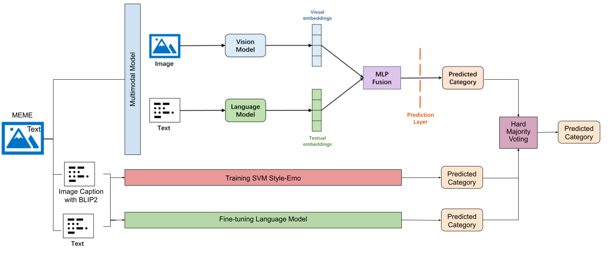

# Exploring Ensemble Strategies for Misogynous and Sexist Meme Detection
This repository contains the code for building and evaluating ensemble strategies on two misogynous and sexist meme datasets. The datasets used in this project were the MAMI (Fersini et al., 2022) and EXIST 2024 (Plaza et al., 2024), which cannot be uploaded due to privacy constraints. However, their authors made them available for research upon request: https://github.com/MIND-Lab/SemEval2022-Task-5-Multimedia-Automatic-Misogyny-Identification-MAMI- and https://nlp.uned.es/exist2024/.

# Overview
This repository contains the code related to the experiments conducted for the research master's thesis project Exploring Ensemble Strategies for Misogynous and Sexist Meme Detection. This thesis was carried out by Ariana Britez with the supervision of dr. Ilia Markov.

Overall architecture of implemented ensemble approach:

The multimodal architecture (upper part of the figure) is based on Wang and Markov (2024c). (Image author: Ariana Britez)


# Project structure

```
.
├── LICENSE
├── README.md
├── data
│   └── README.md
├── datasets
│   └── README.md
├── error_analysis
│   ├── confusion_matrices.ipynb
│   ├── error_analysis.ipynb
│   ├── pearson_coefficient.ipynb
│   └── utils_error_analysis.py
├── models
│   ├── bert.ipynb
│   ├── bert_swin.ipynb
│   ├── bert_vit.ipynb
│   ├── bertweet-large-sexism-detector.ipynb
│   ├── crossdatasets_ensemble.ipynb
│   ├── crossdatasets_roberta.ipynb
│   ├── crossdatasets_roberta_swin.ipynb
│   ├── crossdatasets_style-emo-svm.ipynb
│   ├── evaluation
│   │   └── README.md
│   ├── evaluation.py
│   ├── indomain_ensemble.ipynb
│   ├── indomain_roberta.ipynb
│   ├── indomain_roberta_swin.ipynb
│   ├── indomain_style-emo-svm.ipynb
│   ├── nrc-lexicon-en.txt
│   ├── output
│   │   └── README.md
│   └── utils_classification.py
├── preprocessing
│   ├── README.md
│   ├── datasets
│   ├── dea.ipynb
│   ├── gold_labels.ipynb
│   ├── image_preprocessing.ipynb
│   ├── preprocessing.ipynb
│   ├── utils.py
│   └── utils_dea.py
└── requirements.txt
```

## Requirements

Local experiments were run in Python 3.13.4. \
All required libraries and versions are provided in the requirements.txt file. Run the following command to install them.

`pip install -r requirements.txt`

## README

A README is provided per subfolder with instructions on how to run the code.

1) `/datasets` 

This folder is the location to place the memes dataset MAMI and EXIST 2024. The datasets are available for academic research and are to be requested to their respective authors. The MAMI dataset can be requested at: https://github.com/MIND-Lab/SemEval2022-Task-5-Multimedia-Automatic-Misogyny-Identification-MAMI- The EXIST 2024 meme dataset can be requested at https://nlp.uned.es/exist2024/

2) `/preprocessing`

This folder contains the code to generate the image captions with BLIP-2 (Li et al., 2023) and perform stratied sampling for in-domain as well as cross-dataset experiments.

This folder also contains the code to perform stratified sampling to spit the datasets into training, development, and test splits.

The gold labels and the files to calculate metrics from the predictions are also created in this step.

3) `/data` 

This folder stores the datasets after image captioning and stratified sampling, for both in-domain and cross-dataset experiemnts.

4) `/models` 

This folder contains the code to explore different component models, such as transformer models and multimodal models.

The SVM approach with stylometric and emotion-based features was based on Markov et al. (2021). The multimodal model was based on Wang and Markov (2024a).

The component models explored include text-only transformer models: BERT (Devlin eta., 2019), RoBERta (Liu et al., 2019), and BERTweet for sexism detection (Al-Azzawi et al., 2023), and multimodal models: Swin Trasnformer V2 (Liu et al., 2022). and ViT (Dosovitskiy et al., 2021) with either BERt and RoBERTa.

The metrcis were computed with [PyEvall library](https://github.com/UNEDLENAR/PyEvALL) and the [evaluation script](https://github.com/MIND-Lab/SemEval2022-Task-5-Multimedia-Automatic-Misogyny-Identification-MAMI-/blob/main/Evaluation/evaluation.py) from the MAMI Shared Task (Fersini et al.,2022)


5) `/error_analysis`

This folder contains the code to generate the confusion matrices per label and averaged confusion matrices for each model.

Moreover, it calculates the Pearson correlation coefficient based on the predictions of the component models: SVM with stylometric and emotion-based features, RoBERTa, and Swin Transformer V2+RoBERTa.

Finally, an error analysis per dataset, task and evaluation setting is performed to get insight into the errors. The meme ID, meme text and image caption are printed, but not output is provided here due to privacy constraints that do not allow the datasets to be shared.


